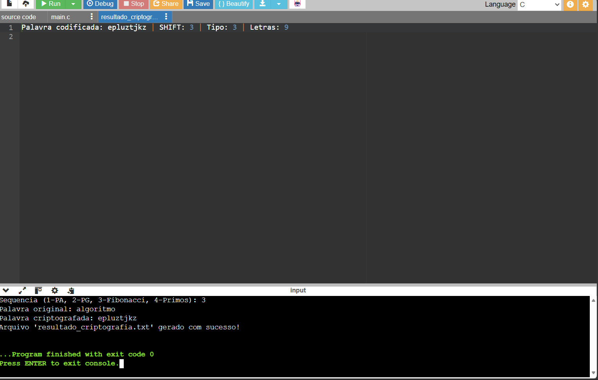

# 🛡️ Trabalho: Criptografia Dupla em Linguagem C

Repositório oficial da Atividade Avaliativa 02 da disciplina de **Algoritmo e Pensamento Computacional**, ministrada pelo professor Francisco de Assis Cavallaro.

---

## 👥 Integrantes
* **Sabrina Souza de Assis** - RGM: 49483731
* **Matheus Pugliese Rodrigues** - RGM: 48379298
* **Rodrigo Veniti dos Santos** - RGM: 49493973
* **Thiago dos Santos Estevam** - RGM: 48967670

---

## 🎯 Apresentação do Projeto
Este projeto tem como objetivo principal aplicar a lógica de programação em **Linguagem C** para resolver um problema de segurança da informação por meio de criptografia dupla. 

Em resumo, a nossa solução funciona em etapas sequenciais:
1. **Escolha da Palavra:** Definimos o termo `algoritmo` (com 9 letras, sem acentos ou caracteres especiais) para ser processado.
2. **Criptografia Camada 1 (Cifra de César):** Aplicamos um deslocamento fixo de 3 posições sobre o alfabeto.
3. **Criptografia Camada 2 (Matemática Aplicada):** Somamos a esse valor o deslocamento dinâmico gerado pelos termos da **Série de Fibonacci**, garantindo que cada letra da palavra sofra uma alteração única baseada em sua posição.
4. **Persistência de Dados (Log):** O sistema automatiza a criação do arquivo `resultado_criptografia.txt`, salvando o resultado codificado de forma permanente.

---

## 📸 Demonstração da Execução

---

## 🚀 Como Executar
1. Certifique-se de ter um compilador de C configurado (ou utilize o ambiente online *OnlineGDB*).
2. Baixe o código fonte contido no arquivo `main.c`.
3. Compile e execute o programa para visualizar a palavra criptografada e gerar o arquivo de log correspondente.
